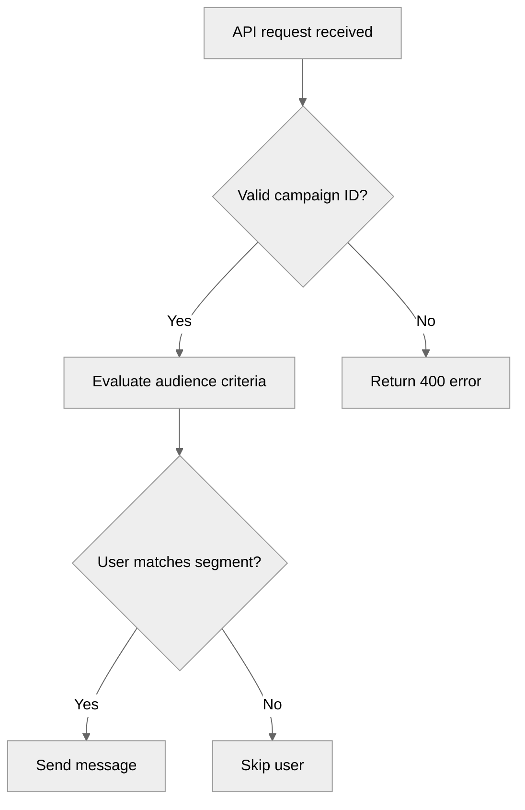

## Mermaid Diagram Support

Mermaid is a JavaScript-based tool that renders text-based definitions into visual diagrams. Braze Docs uses it for flowcharts, sequence diagrams, and state diagrams.

### Syntax

Wrap Mermaid syntax in a fenced code block tagged `mermaid`:

### Diagram Components

| Component | Syntax | Purpose |
|-----------|--------|---------|
| Config block | `--- config: theme: neutral ---` | Sets neutral theme |
| Flowchart | `flowchart TD` | Top-down flowchart |
| Rectangle node | `A[Label]` | Process/action step |
| Diamond node | `B{Label}` | Decision point |
| Arrow | `-->` | Flow connection |
| Labeled arrow | `\|Yes\|` or `\|No\|` | Conditional branch label |

### Supported Diagram Types

- **Flowcharts** — workflows and decision trees
- **Sequence diagrams** — system interactions
- **State diagrams** — state transitions

### Best Practices

- One concept or workflow per diagram; split complex flows into multiple diagrams
- Use consistent shapes: rectangles for processes, diamonds for decisions
- Provide descriptive text before/after the diagram explaining the workflow
- Use meaningful, context-independent labels
- Apply custom styling only when needed for clarity

### Testing

Use the [Mermaid Live Editor](https://mermaid.live/) to validate syntax before submitting. Always preview locally to confirm rendering and that styling matches existing docs diagrams.
